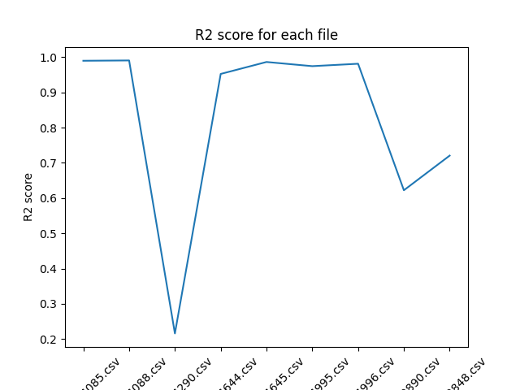

# Climate Data Analysis Project

## Introduction

This project focuses on downloading, processing, and analyzing climate data from the National Centers for Environmental Information (NCEI). It evaluates the consistency of the dataset by calculating the R² score, assessing the agreement between calculated and provided monthly average temperature departure values.

## Requirements

- Python 3.x
- Libraries: pandas, numpy, matplotlib, requests, os, shutil, BeautifulSoup4, mlflow

## Code Overview

1. **Download Function:** 
   - Downloads CSV files containing climate data from NCEI for 2023-2024.
   - Saves files with specific temperature departure columns locally.

2. **Prepare Function (`prepare_data`):**
   - Reads CSV files.
   - Converts specific temperature data to numeric values.
   - Calculates monthly average temperature departure.

3. **Process Function (`process_data`):**
   - Processes monthly data for temperature feature.
   - Groups data by months, calculates mean temperature departure.

4. **Evaluate Function (`r2`):**
   - Calculates R² score for agreement assessment between prepared and processed data.
   - Merges prepared and processed data for comparison.

5. **Evaluate Data Function (`evaluate_data`):**
   - Iterates over all downloaded files.
   - Invokes `prepare_data` and `process_data`.
   - Calculates, plots R² scores for each file.

6. **MLFlow Tracking:**
   - Logs R² scores using MLFlow.
   - Tracks data processing pipeline execution.

## How to Run

1. Ensure all required libraries are installed.
2. Run the script. It will:
   - Download, filter data from NCEI.
   - Prepare, process the data.
   - Evaluate, plot R² scores for each file.
3. Review the output R² score plot and MLFlow logs for analysis results.

## Results

The script generates an R² score plot for each processed file, indicating dataset consistency. The plot is also logged in MLFlow.

